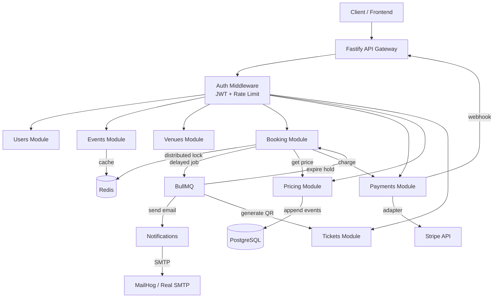
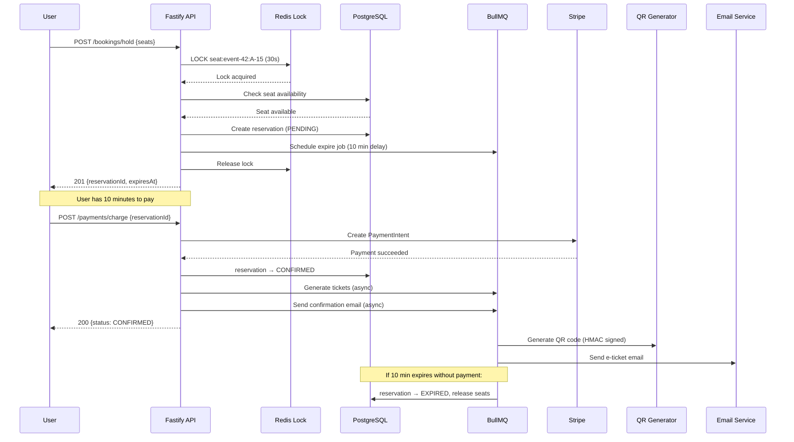

# 🎫 TicketHub — Online Etkinlik Bilet Satış Platformu

> Konserler, tiyatrolar, spor maçları, festivaller için modern bilet satış backend'i.

## 🎨 Interactive Event Storming Workshop

The complete domain discovery process for this project — **8 steps of Event Storming** with draggable post-its, bounded contexts, aggregate roots, and code examples in 3 languages (Node.js / C# / Java).

**👉 [Open Event Storming Workshop](https://1developer1.github.io/tickethub-backend/)**

The workshop covers:
- 📋 Domain events (orange), commands (blue), actors (yellow), policies (purple), read models (green)
- 🎯 3 bounded contexts: Identity, Catalog, Sales
- 🏗️ Aggregate roots, value objects, domain events, domain services
- 🔄 State machines, optimistic concurrency, event-driven architecture
- 💻 Full code examples in **Node.js, C# and Java**

> **First-time setup:** Go to repo **Settings → Pages** → Source: **GitHub Actions**. The site auto-deploys on every push to `main`.

## Mimari

**Modüler Monolith** — her iş alanı ayrı modül ama tek deployment. Büyük şirketler başlangıçta bunu yapıyor, mikroservislere geçiş gerektiğinde modül sınırları zaten hazır.

```
Node.js 20+ │ TypeScript Strict │ Fastify │ Prisma │ PostgreSQL │ Redis │ BullMQ
```

### Modül Haritası

| Modül | Karmaşıklık | Pattern | Açıklama |
|-------|------------|---------|----------|
| **Users** | Basit | Service/Repository | Auth, JWT, argon2id, refresh token rotation |
| **Venues** | Basit | Service/Repository | Mekan CRUD, JSONB koltuk düzeni |
| **Events** | Basit | Service/Repository + Cache | CRUD, PostgreSQL full-text search, Redis cache |
| **Pricing** | Orta | Event Sourcing Lite | Dinamik fiyatlama, append-only events, projections |
| **Booking** | Karmaşık | Domain Model + DDD | Distributed lock, BullMQ delayed jobs, optimistic concurrency |
| **Payments** | Orta | Adapter Pattern | Port/adapter, circuit breaker, idempotency |
| **Tickets** | Basit | Service + Crypto | QR kod (HMAC-SHA256), kapıda doğrulama |
| **Notifications** | Basit | BullMQ Workers | Email/SMS, dead letter queue, MailHog (dev) |

### Mimari Diyagram



### Koltuk Rezervasyon Akışı



## Teknoloji Seçim Tablosu

| Teknoloji | Neden? | Alternatif | Alternatif ne zaman? |
|-----------|--------|------------|---------------------|
| **Fastify** | 2x Express performansı, schema validation, TypeScript-first | Express | Ekip Express'e çok hakimse |
| **Prisma** | Type-safe ORM, auto-generated types, migration | Drizzle | Çok karmaşık raw SQL gerekiyorsa |
| **PostgreSQL** | ACID, full-text search, JSONB, enum | MySQL | Basit web app, MySQL ekosistemi |
| **Redis** | Cache + lock + queue + session (tek araç, çoklu rol) | Memcached | Sadece basit cache gerekiyorsa |
| **BullMQ** | Redis-based, delayed jobs, retry, DLQ | RabbitMQ | 10K+ job/s ölçeğinde |
| **Zod** | Runtime validation, TypeScript type inference | Joi | Daha eski Node.js projelerinde |
| **Biome** | ESLint+Prettier yerine tek araç, 10-30x hızlı | ESLint | Özel lint kuralları gerekiyorsa |
| **argon2id** | Memory-hard, GPU saldırısına dayanıklı | bcrypt | Legacy uyumluluk gerekiyorsa |
| **Vitest** | Jest uyumlu, ESM native, hızlı | Jest | Büyük Jest ekosistemi gerekiyorsa |

## Hızlı Başlangıç

```bash
# 1. Klonla
git clone https://github.com/your-org/tickethub.git
cd tickethub

# 2. Servisleri başlat (PostgreSQL + Redis + MailHog)
docker compose up -d

# 3. Dependencies yükle
npm install

# 4. Prisma client oluştur + migration
npx prisma generate
npm run db:migrate

# 5. Test verisi oluştur
npm run db:seed

# 6. Geliştirme sunucusunu başlat
npm run dev
```

Sunucu: http://localhost:3000
Health check: http://localhost:3000/health
MailHog: http://localhost:8025

## API Endpoints

```
# Auth
POST   /api/v1/auth/register
POST   /api/v1/auth/login
POST   /api/v1/auth/refresh
POST   /api/v1/auth/logout
GET    /api/v1/auth/me

# Events
GET    /api/v1/events              — Arama + filtreleme + pagination
GET    /api/v1/events/:id          — Detay (cached)
POST   /api/v1/events              — Oluştur (ORGANIZER)
PATCH  /api/v1/events/:id          — Güncelle (ORGANIZER)

# Venues
GET    /api/v1/venues
GET    /api/v1/venues/:id
POST   /api/v1/venues              — (ADMIN)
PATCH  /api/v1/venues/:id          — (ADMIN)

# Booking
POST   /api/v1/bookings/hold       — Koltuk tut (10 dk)
GET    /api/v1/bookings/:id
POST   /api/v1/bookings/:id/confirm — Ödeme sonrası onayla
POST   /api/v1/bookings/:id/cancel  — İptal

# Payments
POST   /api/v1/payments/charge     — Ödeme (Idempotency-Key)
POST   /api/v1/payments/refund
POST   /api/v1/payments/webhooks/stripe — Stripe webhook

# Tickets
GET    /api/v1/tickets/:id         — E-bilet
GET    /api/v1/tickets/:id/qr      — QR PNG
POST   /api/v1/tickets/validate    — Kapıda doğrula (ADMIN)

# Pricing
GET    /api/v1/pricing/:eventId    — Güncel fiyatlar
GET    /api/v1/pricing/:eventId/history — Fiyat geçmişi (ADMIN)
POST   /api/v1/pricing/base-price  — Taban fiyat ayarla (ADMIN)
```

## Test

```bash
npm run test              # Unit testler (watch mode)
npm run test:run          # Unit testler (tek sefer)
npm run test:integration  # Integration testler (Testcontainers)
npm run typecheck         # TypeScript tip kontrolü
npm run lint              # Biome lint + format
```

## Scripts

| Script | Açıklama |
|--------|----------|
| `npm run dev` | Geliştirme sunucusu (hot reload) |
| `npm run build` | TypeScript compile |
| `npm run start` | Production sunucu |
| `npm run db:migrate` | Prisma migration |
| `npm run db:seed` | Test verisi |
| `npm run db:studio` | Prisma Studio (DB GUI) |
| `npm run docker:up` | Docker servisleri başlat |
| `npm run docker:down` | Docker servisleri durdur |

## Architecture Decision Records (ADR)

1. [Fastify vs Express](docs/adr/001-fastify-over-express.md)
2. [Modüler monolith vs microservices](docs/adr/002-modular-monolith.md)
3. [Feature-based folder structure](docs/adr/003-feature-based-folders.md)
4. [Domain model sadece gerekli yerde](docs/adr/004-selective-domain-model.md)
5. [Redis distributed lock (Redlock)](docs/adr/005-redis-distributed-lock.md)
6. [BullMQ delayed jobs](docs/adr/006-bullmq-delayed-jobs.md)
7. [Cursor-based pagination](docs/adr/007-cursor-pagination.md)
8. [Integer cents for money](docs/adr/008-integer-cents.md)
9. [Prisma ORM](docs/adr/009-prisma-orm.md)
10. [Event sourcing lite (pricing)](docs/adr/010-event-sourcing-lite.md)
11. [Adapter pattern (payments)](docs/adr/011-adapter-pattern-payments.md)
12. [argon2id password hashing](docs/adr/012-argon2id.md)
